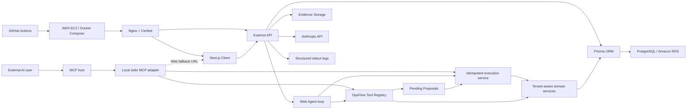

# OpsFlow

OpsFlow is a production-style, multi-tenant field service operations platform built as a full-stack engineering case study. It models the workflows of a real internal SaaS product: dispatch planning, customer and job management, staff assignment, job evidence, completion review, notifications, audit activity, and AI-assisted planning.

The goal of this project is to show how I approach product-grade application engineering beyond a simple CRUD demo. OpsFlow focuses on the boundaries that make real operations software difficult: tenant isolation, role-based access control, workflow integrity, auditability, background operational data, AI-assisted workflows, deployment automation, test coverage, and request-level debugging.

## Why This Matters

OpsFlow is designed to be evaluated quickly as a portfolio project while still holding up under deeper technical review.

- **Full-stack product thinking:** The app covers the full loop from authentication and tenant onboarding to scheduling, field execution, review, notifications, and operational reporting.
- **Real SaaS boundaries:** API requests derive tenant context from authenticated membership, RBAC is enforced server-side, and job workflow transitions are constrained by a domain state machine.
- **Production-style engineering:** The project includes CI, database-backed integration tests, seeded demo data, Docker-based local development, AWS deployment assets, request IDs, structured logs, and health checks.
- **AI inside a controlled workflow:** A provider-neutral Tool Registry powers both the Web Agent and a local MCP server. Natural-language requests become structured proposals; eligible job proposals can be confirmed in the current conversation, while Web approval remains available as a fallback.

## Quick Local Start

```bash
cp .env.example .env
docker compose -f docker-compose.dev.yml up --build
```

Stop the local stack:

```bash
docker compose -f docker-compose.dev.yml down
```

## Live Demo

- App: [https://opsflow.aboutwenduo.wang](https://opsflow.aboutwenduo.wang)

## Demo Accounts

- Owner: `owner@acme.example` / `owner-password-123`
- Manager: `manager@acme.example` / `manager-password-123`
- Staff: `staff@acme.example` / `staff-password-123`
- Additional local staff: `staff02@acme.example` through `staff10@acme.example` / `staff-password-123`

## Suggested Demo Flow

For the quickest walkthrough, use the demo accounts in this order:

1. Sign in as Owner and review the dashboard, schedule preview, activity feed, and team state.
2. Create or open a customer, then create a job for that customer.
3. Assign the job to a staff member and schedule a visit window.
4. Sign in as Staff and open the assigned work queue.
5. Move the job through the field workflow, upload evidence, and submit completion notes for review.
6. Sign in as Manager or Owner, review the completion submission, and approve or return it.
7. Check notifications, activity logs, workflow history, and dashboard changes.
8. Try an invalid action or login failure and use the displayed Request ID to correlate with backend logs.

## Product Capabilities

- Multi-tenant workspaces with tenant-scoped customer, job, team, and activity data
- Authentication, refresh-session handling, tenant switching, and demo accounts
- Role-based access control for `OWNER`, `MANAGER`, and `STAFF`
- Customer management with active/archived views
- Job creation, editing, scheduling, assignment, and status lifecycle tracking
- Staff-focused "My Jobs" workspace for assigned work
- Completion review flow for staff submission and manager approval or return
- Evidence uploads for site photos, completion proof, customer documents, and issue evidence
- Team invitations, membership management, and tenant onboarding flows
- Activity feed and audit logging for operational traceability
- In-app notifications with unread state and SSE updates
- AI-assisted dispatch planner with Proposal-first writes and explicit conversational or Web confirmation
- Local stdio MCP server with read, Proposal, status, and idempotent execution tools backed by the same tenant-aware services as the Web Agent

## Engineering Highlights

- **Tenant isolation:** API requests derive tenant context from authenticated membership rather than trusting client-provided tenant IDs.
- **RBAC enforcement:** Owner, manager, and staff capabilities are enforced across API routes and reflected in the UI.
- **Workflow state machine:** Job status transitions are constrained, audited, and surfaced through timeline/history views.
- **Request-level observability:** Every API response carries `X-Request-Id`; error responses include `requestId`; backend logs are structured; frontend error surfaces display Request IDs for support/debugging.
- **Streaming UX:** Notifications and AI planner responses use SSE-style streaming flows.
- **Portable AI tools:** Canonical Zod contracts and execution handlers live in one Tool Registry; provider and MCP adapters only translate schemas and protocol messages.
- **AI safety and audit:** Tool exposure is role/audience filtered, proposal tools are approval-gated, and Web/MCP invocations record PII-minimized audit metadata.
- **Storage abstraction:** Job evidence is handled through a storage layer that can be upgraded from local storage to object storage.
- **Seeded demo data:** Local and production demo seeds create realistic tenants, customers, jobs, staff, schedules, reviews, notifications, and activity.
- **Deployment pipeline:** GitHub Actions deploys to AWS EC2 with Docker Compose, Nginx, Certbot, health checks, and rollback support.
- **Test coverage:** Client and server tests cover UI behavior, API contracts, domain flows, auth/session logic, and operational edge cases.

## Architecture



More details:

- [Engineering architecture](docs/engineering/architecture.md)
- [Local MCP integration](docs/engineering/mcp.md)
- [API design](docs/engineering/api-design.md)
- [OpenAPI contract](docs/engineering/openapi.yaml)
- [Entity relationship design](docs/engineering/erd.md)
- [Implementation plan](docs/product/implementation-plan.md)
- [Roadmap](docs/product/roadmap.md)

## AI Dispatch Planner And MCP

OpsFlow includes an AI-powered dispatch planner designed for operational workflows rather than generic chat. Its business tools are provider-neutral and shared by two entry points: the in-app Web Agent tool loop and a local stdio MCP server for external MCP hosts.

It can help turn natural-language requests into structured dispatch proposals by:

- interpreting customer and job intent
- drafting a schedule window
- suggesting a likely assignee
- generating a structured proposal before any write happens
- showing the pending change and waiting for a new, explicit confirmation message
- executing eligible job creation, assignment, and scheduling proposals idempotently

The MCP surface intentionally exposes a narrower set of tools. `propose_create_job` and `propose_dispatch_job` create pending Proposals; `get_proposal` reads their current state; and `execute_proposal` can execute only `CREATE_JOB`, `ASSIGN_JOB`, or `SCHEDULE_JOB` after the host has shown the Proposal and received a later confirmation message. The returned `approvalUrl` and the Web `Confirm plan` button remain available as a fallback. Customer changes, job detail/status changes, and cancellations stay Web-only.

For the Web Agent, OpsFlow verifies that the confirmation is a newer persisted User Message and that `confirmationText` matches it exactly. An external MCP server cannot independently prove that text came from a human, so it relies on the MCP host's conversation and native tool-approval behavior; this trust boundary is documented explicitly.

See [Local MCP Integration](docs/engineering/mcp.md) for the architecture, exposed tools, access-token setup, client configuration, and current local-only scope.

## Tech Stack

- Frontend: Next.js 16, React, TypeScript, Tailwind CSS
- Backend: Express, TypeScript, Prisma, PostgreSQL
- State and validation: Zustand, TanStack Query, React Hook Form, Zod
- AI: Anthropic SDK, Model Context Protocol TypeScript SDK, Zod Tool Registry, SSE streaming responses
- Infrastructure: AWS EC2, Amazon RDS, Docker Compose, Nginx, Certbot
- CI/CD: GitHub Actions, SSH-based production deployment, health checks, rollback support

## Local Development

### Project Structure

- `client` - Next.js application
- `server` - Express API
- `docs` - product, engineering, and design documentation
- `infra` - deployment, nginx, and production operations assets

### Start With Docker

```bash
cp .env.example .env
docker compose -f docker-compose.dev.yml up --build
```

### Start In Detached Mode

```bash
docker compose -f docker-compose.dev.yml up --build -d
```

### Stop The Development Environment

```bash
docker compose -f docker-compose.dev.yml down
```

### Local Ports

- Client: `http://localhost:3000`
- Server: `http://localhost:4000`
- PostgreSQL: `localhost:5432`

## Validation Commands

```bash
cd client && pnpm build && pnpm lint && pnpm test
cd server && pnpm typecheck && pnpm build && pnpm test
```

Database and seed commands:

```bash
cd server && pnpm prisma:migrate:deploy && pnpm prisma:seed
cd server && pnpm db:reset
```

## Seed Data

The Prisma seed is development-only demo data for the Docker/local PostgreSQL database. It resets the database and creates one `Acme Home Services` tenant with demo accounts, around 80 customers, around 250 jobs, archived customers, cancelled jobs, status history, completion reviews, notifications, and audit activity.

Job dates are generated relative to the day the seed runs, so scheduled and in-progress work stays current when you reseed later. To reproduce a specific date window, set `DEMO_SEED_BASE_DATE`:

```bash
docker compose -f docker-compose.dev.yml up --build -d
cd server && pnpm db:reset
DEMO_SEED_BASE_DATE=2026-04-21 pnpm prisma:seed
```

The seed refuses to run against non-default database URLs unless `ALLOW_NON_DEV_SEED=1` is set. Use that override only for a known safe development database.

To test the production-sized demo seed against a safe local database:

```bash
cd server
DEMO_SEED_CONFIRM=reset-production-demo pnpm demo:seed:production
```

## Deployment

The project is currently deployed on AWS:

- application services run on EC2
- PostgreSQL is hosted on Amazon RDS
- containerized services are managed with Docker Compose
- HTTPS is served through Nginx and Certbot

The public demo uses the same core login accounts as local development, but it resets to a smaller data set: about 6 team members, 10 customers, and 20 jobs. The reset is tenant-scoped to `Acme Home Services`, so visitor-created tenants are not deleted.

GitHub Actions runs the reset workflow daily and it can also be triggered manually from the Actions tab. The workflow SSHs into EC2 and runs:

```bash
DEPLOY_PATH=/path/to/opsflow infra/scripts/reset-demo-data.sh
```

The production demo reset requires `DEMO_SEED_CONFIRM=reset-production-demo` internally and only refreshes the fixed demo tenant.
