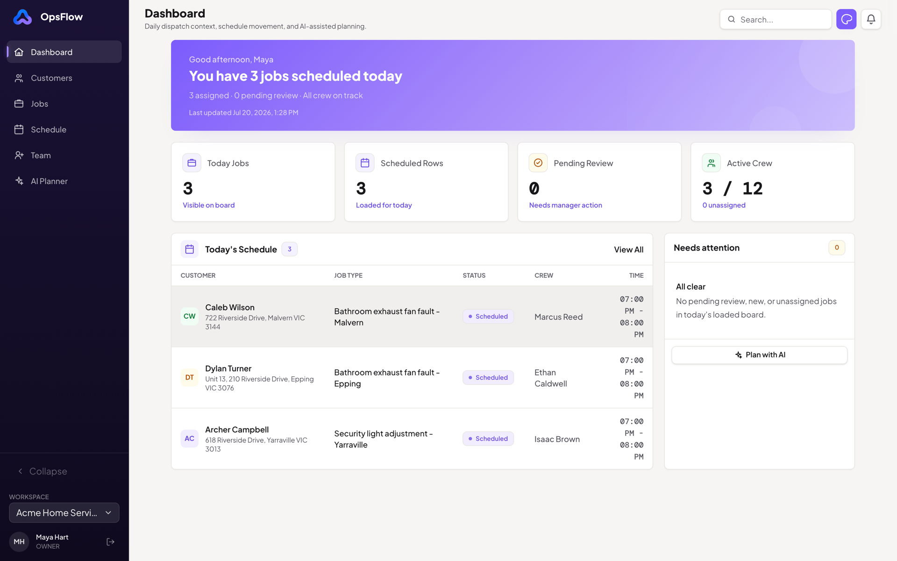
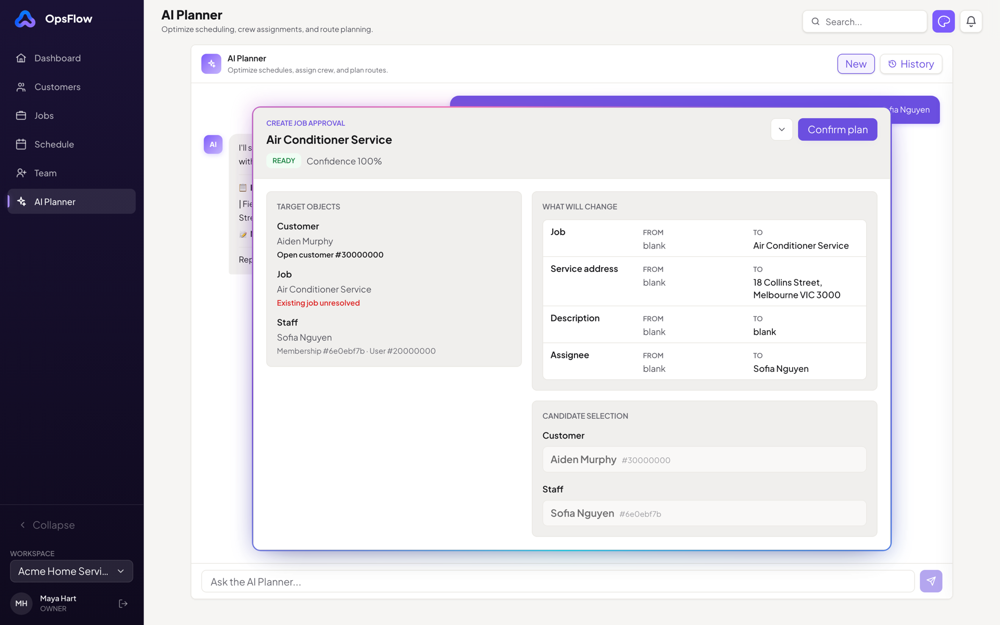
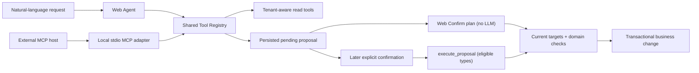
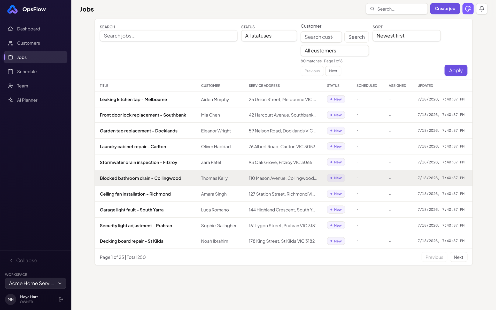
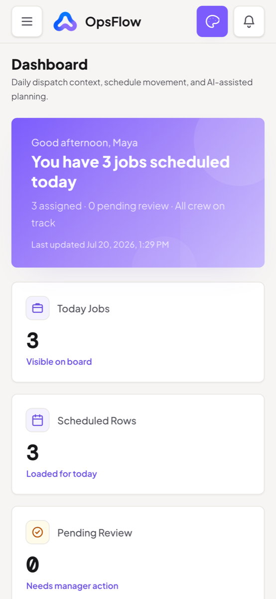

<p align="center">
  
</p>

<h1 align="center">OpsFlow</h1>

<p align="center"><strong>AI-assisted field operations, with a human approval boundary.</strong></p>

<p align="center">
  <a href="https://opsflow.aboutwenduo.wang/login">Live Demo</a> ·
  <a href="#90-second-walkthrough">90-Second Walkthrough</a> ·
  <a href="https://github.com/shuttle666/opsflow">View Source</a> ·
  <a href="docs/engineering/architecture.md">Architecture</a> ·
  <a href="docs/engineering/case-study.md">Engineering Case Study</a> ·
  <a href="https://aboutwenduo.wang">Portfolio</a>
</p>

<p align="center">
  <a href="https://github.com/shuttle666/opsflow/actions/workflows/ci.yml">
    
  </a>
</p>

OpsFlow is a production-style, multi-tenant platform for field-service teams: customers, jobs, schedules, assignments, field evidence, and completion review in one operational workflow.

Its differentiator: **AI prepares the plan; people approve the change.** The in-app Web Agent and a local MCP server share one tenant-aware Tool Registry, and every AI-initiated business change stops at a structured proposal until an Owner or Manager reviews and confirms it. [How the boundary works →](#the-differentiator-safe-ai-writes)

<p align="center">
  
</p>
<p align="center"><sub>The Owner dashboard: today's dispatch context, schedule movement, and the entry point into AI-assisted planning.</sub></p>

**Recommended:** choose **Start a quick demo** on the sign-in page. It creates a prefilled, isolated workspace for the current visitor without registration.

> Quick demo workspaces are isolated per visitor, expire after 60 minutes, carry a six-request AI budget, and are removed in background cleanup. The shared role accounts below remain available for the multi-role walkthrough; use fictional sample data in every demo environment.

## What this project demonstrates

- **An end-to-end product loop:** intake, dispatch, field execution, completion review, audit, and notifications work as one system rather than disconnected CRUD screens.
- **Real SaaS boundaries:** tenant context comes from authenticated membership, role checks are enforced server-side, and job transitions follow a domain state machine.
- **Human-approved AI actions:** model-initiated writes become reviewable proposals instead of direct operational mutations.
- **Portable AI tooling:** the Web Agent and local MCP adapter consume the same Zod contracts, role policies, and domain handlers.
- **Production-minded delivery:** PostgreSQL migrations, database-backed integration tests, request IDs, structured logs, Docker, GitHub Actions, and an AWS deployment are part of the repository.

## 90-second walkthrough

1. [Open the demo](https://opsflow.aboutwenduo.wang/login), choose **Start a quick demo**, and scan today’s work on **Dashboard** and **Schedule**.
2. Open **AI Planner** and select the Golden Demo prompt for Aiden Murphy and Sofia Nguyen.
3. Inspect the structured proposal. At this point, the requested customer or job change has not been applied.
4. Review the resolved customer, job, assignee, schedule, blockers, and warnings, then select **Confirm plan**.
5. Open the affected job to inspect its assignment, status, workflow history, and notifications.

For the full role-based loop, continue as Staff to progress an assigned job, upload evidence, and submit completion notes. Then return as Manager or Owner to approve the work or send it back for rework.

| Role | Email | Password | Best for |
| --- | --- | --- | --- |
| Owner | `owner@acme.example` | `owner-password-123` | AI planning, workspace controls, and the complete demo |
| Manager | `manager@acme.example` | `manager-password-123` | Dispatch, assignment, scheduling, and completion review |
| Staff | `staff@acme.example` | `staff-password-123` | Assigned work, evidence, and field workflow |

## The differentiator: safe AI writes

OpsFlow treats model output as an untrusted plan, not as permission to operate the business.

<p align="center">
  
</p>
<p align="center"><sub>The AI Planner stops at a structured proposal: resolved targets, a field-by-field diff, and candidate selection. Nothing changes until an Owner or Manager selects <strong>Confirm plan</strong>.</sub></p>

AI read tools see only role-appropriate, tenant-scoped data, and AI write tools go no further than persisting a proposal. Executing one is a separate authenticated step: the strongest path is the Web **Confirm plan** button, which does not depend on an LLM interpreting consent, and a limited set of job proposals can also be confirmed conversationally against a strict server-side allowlist. At confirmation time, OpsFlow claims the proposal with a single-execution guard, reloads current tenant-scoped targets, re-checks domain rules, and applies the change inside a database transaction.



The MCP adapter shares the same registry but exposes a deliberately narrower surface, and an external MCP host remains an explicit, documented trust boundary. The full confirmation semantics — eligible proposal types, the confirmation-phrase allowlist, post-proposal message matching, and host responsibilities — are specified in [MCP design and security boundary](docs/engineering/mcp.md).

### Risk → Control → Evidence

| Risk | Control | Repository evidence |
| --- | --- | --- |
| A model applies an unintended business change | AI write tools persist a pending proposal; execution is a separate non-LLM Web action or an allowlisted, post-proposal conversational confirmation | [Proposal tools](server/src/modules/operations-tools/definitions/proposal-tools.ts), [confirmation boundary](docs/engineering/mcp.md#confirmation-and-trust-boundary) |
| A caller invokes a hidden or role-restricted tool directly | Audience and role policies are checked during discovery and checked again during Registry execution; inputs and outputs are validated with Zod | [Tool Registry](server/src/modules/operations-tools/tool-registry.ts) |
| A proposal points to stale or invalid operational data | Confirmation reloads key tenant-scoped targets and enforces active-staff, target-safety, and workflow rules before commit | [Proposal confirmation](server/src/modules/agent/agent.service.ts) |
| Two requests try to confirm the same proposal | A conditional `PENDING → CONFIRMING` transition allows only one confirmation path to proceed | [Confirmation guard](server/src/modules/agent/agent.service.ts) |
| An external host misrepresents user consent | The server rejects non-allowlisted confirmation text; provenance stays a documented host responsibility, with Web confirmation as the stronger fallback | [MCP trust boundary](docs/engineering/mcp.md#confirmation-and-trust-boundary) |
| Web and MCP behavior drift apart | Both adapters use the same canonical tool schemas, access policies, and execution handlers | [MCP architecture](docs/engineering/mcp.md#architecture) |
| Invocation audit duplicates raw customer or job values | The dedicated `ToolInvocation` record stores source, status, duration, correlation IDs, and top-level field names rather than raw argument or result values | [Invocation audit](server/src/modules/operations-tools/tool-invocation-audit.ts) |

The PII-minimized statement applies to `ToolInvocation` metadata; conversations, proposals, and tool traces are persisted so the workflow stays recoverable and reviewable.

## One operational loop, three roles

```text
Customer intake → Job creation → Assignment and scheduling
→ Field evidence → Completion review → Audit and notifications
```

- **Owners** manage the workspace, team access, and operational controls.
- **Managers** coordinate customers, jobs, schedules, assignments, and completion review.
- **Staff** see assigned work, progress jobs, upload evidence, and submit completion notes.

<p align="center">
  
  
</p>
<p align="center"><sub>The same tenant-scoped workflows on desktop and a phone viewport; mobile layouts are covered by an axe accessibility smoke test in CI.</sub></p>

The product also includes tenant invitations, customer archiving, schedule conflict checks, authenticated notification streaming, activity history, and request IDs that connect frontend errors to structured backend logs.

## Engineering evidence

| Boundary | Implementation |
| --- | --- |
| Tenant isolation | Web and MCP calls revalidate current membership and tenant state; business queries and relationships remain tenant-scoped |
| Authorization | Server routes, domain services, and AI tools enforce role-aware access for Owner, Manager, and Staff |
| Workflow integrity | Job status transitions are constrained, recorded in history, and surfaced in the UI |
| Client server state | TanStack Query caches are scoped by tenant, user, and role; mutations reconcile entity caches and invalidate affected workflows |
| Persisted AI workflow | Conversations, tool traces, proposals, review state, and confirmation evidence are stored in PostgreSQL |
| Operational debugging | API responses carry `X-Request-Id`; error responses and client error surfaces preserve it; backend request and error logs are structured |
| Delivery | CI validates client and server builds, the real Nginx ingress boundary, PostgreSQL-backed integration tests, deterministic Chromium workflows, and a mobile axe smoke check |

The public application is deployed to AWS with EC2, RDS, Docker Compose, Nginx, and HTTPS. The codebase stays a modular monolith so domain boundaries are explicit without introducing distributed-system complexity that the current product does not need.

## Five-minute code tour

- [Tenant membership revalidation](server/src/modules/auth/auth-context.ts) — Web and MCP calls re-establish current tenant, membership, and role context before protected work.
- [Job state machine](server/src/modules/job/job-status-machine.ts) — operational status changes are constrained by domain rules.
- [Canonical Tool Registry](server/src/modules/operations-tools/tool-registry.ts) — Web and MCP tools share schemas, audience rules, role rules, execution, and invocation audit hooks.
- [Proposal confirmation](server/src/modules/agent/agent.service.ts) — approved plans re-check key targets and execute through transactional domain services.
- [Authorization-scoped Query keys](client/src/lib/query-keys.ts) — REST caches include tenant, user, and role context before domain and request parameters.
- [Database-backed CI](.github/workflows/ci.yml) — migrations and integration tests run against a real PostgreSQL service.
- [Role workflow E2E](client/e2e/role-workflow.spec.ts) — Owner dispatch, Staff evidence and completion submission, and Manager approval run as one browser scenario.
- [Safe AI E2E](client/e2e/agent-proposal.spec.ts) — proposal-first writes, explicit approval, conversational confirmation safeguards, and idempotent replay are verified without a live LLM.
- [API security integration](server/tests/security.api.integration.test.ts) — cross-tenant ID probes, stale authorization, Request ID correlation, and Proposal idempotency run through the HTTP stack.
- [Database tenant integrity](server/tests/database-tenant-integrity.integration.test.ts) — composite foreign keys reject cross-tenant child records at the PostgreSQL boundary.
- [Mobile accessibility smoke](client/e2e/accessibility.spec.ts) — the landing page, sign-in, and authenticated Dashboard are checked at a phone viewport with axe.
- [Nginx ingress smoke](infra/nginx/smoke/smoke-test.mjs) — the deployable proxy is exercised for forwarded IP normalization, spoof-resistant rate-limit keys, 10 MiB multipart uploads, finite body limits, host routing, and unbuffered SSE.
- [Testing strategy](docs/engineering/testing.md) — explains the test layers, CI jobs, deterministic fixtures, database guardrails, and deliberate limits.
- [OpenAPI contract](docs/engineering/openapi.yaml) — the implemented HTTP surface is documented as a machine-readable contract.

## Tech stack

- **Frontend:** Next.js 16, React 19, TypeScript, Tailwind CSS, TanStack Query, Zustand, React Hook Form, Zod
- **Backend:** Express 5, TypeScript, Prisma, PostgreSQL
- **AI:** Anthropic SDK, Model Context Protocol TypeScript SDK, shared Zod Tool Registry, SSE streaming
- **Testing:** Vitest, Testing Library, Supertest, Playwright, PostgreSQL integration tests
- **Infrastructure:** Docker Compose, GitHub Actions, AWS EC2, Amazon RDS, Nginx, Certbot

## Run locally

```bash
cp .env.example .env
docker compose -f docker-compose.dev.yml up --build -d
```

The containers apply database migrations automatically. To create the local demo accounts and seeded workspace, run:

```bash
docker compose -f docker-compose.dev.yml exec server pnpm db:reset
```

> `db:reset` is destructive. Use it only against the local Docker development database.

Open:

- Client: [http://localhost:3000](http://localhost:3000)
- API health: [http://localhost:4000/api/health](http://localhost:4000/api/health)

Stop the stack:

```bash
docker compose -f docker-compose.dev.yml down
```

## Validate the project

```bash
pnpm --dir client lint
pnpm --dir client typecheck
pnpm --dir client test
pnpm --dir client build

pnpm --dir server typecheck
pnpm --dir server test
pnpm --dir server build

infra/nginx/smoke/run.sh
```

Three heavier suites run in CI: database integration tests against a disposable PostgreSQL service (cross-tenant attack probes, constraint checks, MCP authorization revocation, and concurrency/idempotency coverage — see [the test notes](server/tests/README.md) for local flags), the Playwright suite covering the full Owner → Staff → Manager loop and the guarded AI proposal flow with a deterministic, network-free Fake AI provider (no Anthropic or OpenAI key needed — see [testing strategy](docs/engineering/testing.md) and [E2E notes](client/e2e/README.md)), and an isolated Nginx smoke that sends real requests through the production proxy template without any application secrets.

## Current scope

OpsFlow is production-shaped rather than presented as production-complete.

- MCP currently uses local stdio; remote transport, public client registration, and OAuth are deferred.
- Evidence storage is local-disk behind an abstraction; an S3-compatible implementation is a planned upgrade.
- Advanced route optimization, third-party integrations, payments, and a customer portal are outside the current case-study scope.
- Quick demo workspaces are short-lived and isolated, while the optional role accounts remain shared; neither is a place for real customer or operational data.

## Deeper documentation

- [Engineering case study: role, scope, trade-offs, and retrospective](docs/engineering/case-study.md)
- [Testing strategy](docs/engineering/testing.md)
- [Architecture](docs/engineering/architecture.md)
- [MCP design and security boundary](docs/engineering/mcp.md)
- [API design](docs/engineering/api-design.md)
- [OpenAPI specification](docs/engineering/openapi.yaml)
- [Entity relationship model](docs/engineering/erd.md)
- [Product requirements](docs/product/prd.md)
- [Roadmap](docs/product/roadmap.md)

## About and contribution

OpsFlow is an independently owned portfolio engineering case study by [Wenduo Wang](https://aboutwenduo.wang). I defined the product and architecture, implemented and reviewed the system, set its security boundaries, and own verification and final acceptance. AI tools assisted design exploration, implementation, and review; the [Engineering Case Study](docs/engineering/case-study.md) explains that workflow and the decisions that remained mine.

Released under the [MIT License](LICENSE).

[GitHub profile](https://github.com/shuttle666) · [Project source](https://github.com/shuttle666/opsflow) · [Portfolio](https://aboutwenduo.wang)
