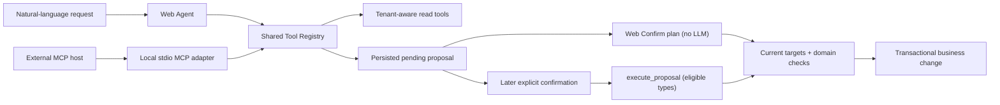

<p align="center">
  
</p>

<h1 align="center">OpsFlow</h1>

<p align="center"><strong>AI-assisted field operations, with a human approval boundary.</strong></p>

<p align="center">
  <a href="https://opsflow.aboutwenduo.wang/login">Live Demo</a> ·
  <a href="#90-second-walkthrough">90-Second Walkthrough</a> ·
  <a href="https://github.com/shuttle666/opsflow">View Source</a> ·
  <a href="docs/engineering/architecture.md">Architecture</a> ·
  <a href="docs/engineering/case-study.md">Engineering Case Study</a> ·
  <a href="https://aboutwenduo.wang">Portfolio</a>
</p>

<p align="center">
  <a href="https://github.com/shuttle666/opsflow/actions/workflows/ci.yml">
    
  </a>
</p>

OpsFlow is a production-style, multi-tenant platform for service teams to manage customers, jobs, schedules, assignments, field evidence, and completion review in one operational workflow.

Its differentiator is not another AI chat box. The in-app Web Agent and a local MCP server share the same tenant-aware Tool Registry. AI-initiated business changes stop at a structured pending proposal. The Web flow does not accept the original request as confirmation; the MCP contract requires the same later checkpoint and explicitly treats faithful confirmation handling as the external host's responsibility. An Owner or Manager must review and authorize the proposal before customer or job data is changed.

**Demo Owner:** `owner@acme.example` / `owner-password-123`

> The public demo is a shared sandbox. Use fictional sample data only. Core operational demo data is re-seeded daily, but the environment should not be used for private or sensitive information.

## What this project demonstrates

- **An end-to-end product loop:** intake, dispatch, field execution, completion review, audit, and notifications work as one system rather than disconnected CRUD screens.
- **Real SaaS boundaries:** tenant context comes from authenticated membership, role checks are enforced server-side, and job transitions follow a domain state machine.
- **Human-approved AI actions:** model-initiated writes become reviewable proposals instead of direct operational mutations.
- **Portable AI tooling:** the Web Agent and local MCP adapter consume the same Zod contracts, role policies, and domain handlers.
- **Production-minded delivery:** PostgreSQL migrations, database-backed integration tests, request IDs, structured logs, Docker, GitHub Actions, and an AWS deployment are part of the repository.

## 90-second walkthrough

1. [Sign in as the Demo Owner](https://opsflow.aboutwenduo.wang/login) and scan today’s work on **Dashboard** and **Schedule**.
2. Open **AI Planner** and ask it to prepare a customer, job, assignment, or scheduling change using the sample data.
3. Inspect the structured proposal. At this point, the requested customer or job change has not been applied.
4. Review the resolved customer, job, assignee, schedule, blockers, and warnings, then select **Confirm plan**.
5. Open the affected job to inspect its assignment, status, workflow history, and notifications.

For the full role-based loop, continue as Staff to progress an assigned job, upload evidence, and submit completion notes. Then return as Manager or Owner to approve the work or send it back for rework.

| Role | Email | Password | Best for |
| --- | --- | --- | --- |
| Owner | `owner@acme.example` | `owner-password-123` | AI planning, workspace controls, and the complete demo |
| Manager | `manager@acme.example` | `manager-password-123` | Dispatch, assignment, scheduling, and completion review |
| Staff | `staff@acme.example` | `staff-password-123` | Assigned work, evidence, and field workflow |

## The differentiator: safe AI writes

OpsFlow treats model output as an untrusted plan, not as permission to operate the business.

Read tools can inspect role-appropriate, tenant-scoped data. Write-oriented AI tools can persist a proposal, but they do not directly mutate customers or jobs. Execution is a separate authenticated step restricted to the Owner or Manager who owns that conversation and proposal.

The strongest path is the Web **Confirm plan** button because it does not depend on an LLM interpreting consent. A deliberately limited set of job proposals (`CREATE_JOB`, `ASSIGN_JOB`, and `SCHEDULE_JOB`) may also execute through `execute_proposal`, but only after the proposal has been shown and the user sends a later confirmation message. The server accepts only a small allowlist of short confirmation phrases and rejects questions, qualifications, revisions, and other free-form text. The Web Agent additionally verifies that the verbatim confirmation matches a persisted post-proposal user message and that the conversation has exactly one pending proposal; an external MCP host remains an explicit trust boundary responsible for presenting the proposal and proving that the supplied confirmation came from a later human response.

At confirmation time, OpsFlow claims the pending proposal with a single-execution guard, reloads current tenant-scoped targets, checks key domain rules, and applies the approved changes inside a database transaction.



The MCP surface is deliberately narrower than the Web Agent. It exposes selected reads, job proposal inspection, and conversational execution only for the eligible job operations above. Every proposal still returns an approval URL: it is the fallback for hosts without a suitable confirmation flow and the required path for Web-only proposal types such as customer changes, job detail/status changes, and cancellations.

### Risk → Control → Evidence

| Risk | Control | Repository evidence |
| --- | --- | --- |
| A model applies an unintended business change | AI write tools persist a pending proposal; the Web button is a separate non-LLM action, while conversational execution requires allowlisted text and the Web Agent also requires one unambiguous pending proposal plus a matching post-proposal user message | [Proposal tools](server/src/modules/operations-tools/definitions/proposal-tools.ts), [confirmation boundary](docs/engineering/mcp.md#confirmation-and-trust-boundary) |
| A caller invokes a hidden or role-restricted tool directly | Audience and role policies are checked during discovery and checked again during Registry execution; inputs and outputs are validated with Zod | [Tool Registry](server/src/modules/operations-tools/tool-registry.ts) |
| A proposal points to stale or invalid operational data | Confirmation reloads key tenant-scoped targets and enforces active-staff, target-safety, and workflow rules before commit | [Proposal confirmation](server/src/modules/agent/agent.service.ts) |
| Two requests try to confirm the same proposal | A conditional `PENDING → CONFIRMING` transition allows only one confirmation path to proceed | [Confirmation guard](server/src/modules/agent/agent.service.ts) |
| An external host misrepresents user consent | The server rejects non-allowlisted confirmation text and the MCP contract marks execution destructive, but provenance and turn ordering remain documented host responsibilities; Web confirmation is the stronger fallback | [MCP trust boundary](docs/engineering/mcp.md#confirmation-and-trust-boundary) |
| Web and MCP behavior drift apart | Both adapters use the same canonical tool schemas, access policies, and execution handlers | [MCP architecture](docs/engineering/mcp.md#architecture) |
| Invocation audit duplicates raw customer or job values | The dedicated `ToolInvocation` record stores source, status, duration, correlation IDs, and top-level field names rather than raw argument or result values | [Invocation audit](server/src/modules/operations-tools/tool-invocation-audit.ts) |

The PII-minimized statement above applies specifically to `ToolInvocation` metadata. Agent conversations, proposals, and tool traces are persisted so the workflow can recover across restarts and remain reviewable.

## One operational loop, three roles

```text
Customer intake → Job creation → Assignment and scheduling
→ Field evidence → Completion review → Audit and notifications
```

- **Owners** manage the workspace, team access, and operational controls.
- **Managers** coordinate customers, jobs, schedules, assignments, and completion review.
- **Staff** see assigned work, progress jobs, upload evidence, and submit completion notes.

The product also includes tenant invitations, customer archiving, schedule conflict checks, authenticated notification streaming, activity history, and request IDs that connect frontend errors to structured backend logs.

## Engineering evidence

| Boundary | Implementation |
| --- | --- |
| Tenant isolation | Requests derive tenant context from authenticated membership; business queries and relationships remain tenant-scoped |
| Authorization | Server routes, domain services, and AI tools enforce role-aware access for Owner, Manager, and Staff |
| Workflow integrity | Job status transitions are constrained, recorded in history, and surfaced in the UI |
| Client server state | TanStack Query caches are scoped by tenant, user, and role; mutations reconcile entity caches and invalidate affected workflows |
| Persisted AI workflow | Conversations, tool traces, proposals, review state, and confirmation evidence are stored in PostgreSQL |
| Operational debugging | API responses carry `X-Request-Id`; error responses and client error surfaces preserve it; backend request and error logs are structured |
| Delivery | CI validates client and server builds and runs PostgreSQL-backed migration and integration tests before the main branch deploys |

The public application is deployed to AWS with EC2, RDS, Docker Compose, Nginx, and HTTPS. The codebase stays a modular monolith so domain boundaries are explicit without introducing distributed-system complexity that the current product does not need.

## Five-minute code tour

- [Tenant membership revalidation](server/src/middleware/require-tenant-access.ts) — tenant and role context is re-established on protected requests.
- [Job state machine](server/src/modules/job/job-status-machine.ts) — operational status changes are constrained by domain rules.
- [Canonical Tool Registry](server/src/modules/operations-tools/tool-registry.ts) — Web and MCP tools share schemas, audience rules, role rules, execution, and invocation audit hooks.
- [Proposal confirmation](server/src/modules/agent/agent.service.ts) — approved plans re-check key targets and execute through transactional domain services.
- [Authorization-scoped Query keys](client/src/lib/query-keys.ts) — REST caches include tenant, user, and role context before domain and request parameters.
- [Database-backed CI](.github/workflows/ci.yml) — migrations and integration tests run against a real PostgreSQL service.
- [OpenAPI contract](docs/engineering/openapi.yaml) — the implemented HTTP surface is documented as a machine-readable contract.

## Tech stack

- **Frontend:** Next.js 16, React 19, TypeScript, Tailwind CSS, TanStack Query, Zustand, React Hook Form, Zod
- **Backend:** Express 5, TypeScript, Prisma, PostgreSQL
- **AI:** Anthropic SDK, Model Context Protocol TypeScript SDK, shared Zod Tool Registry, SSE streaming
- **Testing:** Vitest, Testing Library, Supertest, Playwright, PostgreSQL integration tests
- **Infrastructure:** Docker Compose, GitHub Actions, AWS EC2, Amazon RDS, Nginx, Certbot

## Run locally

```bash
cp .env.example .env
docker compose -f docker-compose.dev.yml up --build -d
```

The containers apply database migrations automatically. To create the local demo accounts and seeded workspace, run:

```bash
docker compose -f docker-compose.dev.yml exec server pnpm db:reset
```

> `db:reset` is destructive. Use it only against the local Docker development database.

Open:

- Client: [http://localhost:3000](http://localhost:3000)
- API health: [http://localhost:4000/api/health](http://localhost:4000/api/health)

Stop the stack:

```bash
docker compose -f docker-compose.dev.yml down
```

## Validate the project

```bash
pnpm --dir client lint
pnpm --dir client typecheck
pnpm --dir client test
pnpm --dir client build

pnpm --dir server typecheck
pnpm --dir server test
pnpm --dir server build
```

Server database integration tests are intentionally separated from the default local test command and run in CI against a disposable PostgreSQL service. See [the test notes](server/tests/README.md) for the local database-test flags.

## Current scope

OpsFlow is production-shaped rather than presented as production-complete.

- MCP currently uses local stdio; remote transport, public client registration, and OAuth are deferred.
- Evidence storage is local-disk behind an abstraction; an S3-compatible implementation is a planned upgrade.
- Advanced route optimization, third-party integrations, payments, and a customer portal are outside the current case-study scope.
- The public environment is a shared demonstration system, not a place for real customer or operational data.

## Deeper documentation

- [Engineering case study: role, scope, trade-offs, and retrospective](docs/engineering/case-study.md)
- [Architecture](docs/engineering/architecture.md)
- [MCP design and security boundary](docs/engineering/mcp.md)
- [API design](docs/engineering/api-design.md)
- [OpenAPI specification](docs/engineering/openapi.yaml)
- [Entity relationship model](docs/engineering/erd.md)
- [Product requirements](docs/product/prd.md)
- [Roadmap](docs/product/roadmap.md)

## About and contribution

OpsFlow is an independently owned portfolio engineering case study by [Wenduo Wang](https://aboutwenduo.wang). I defined the product and architecture, implemented and reviewed the system, set its security boundaries, and own verification and final acceptance. AI tools assisted design exploration, implementation, and review; the [Engineering Case Study](docs/engineering/case-study.md) explains that workflow and the decisions that remained mine.

[GitHub profile](https://github.com/shuttle666) · [Project source](https://github.com/shuttle666/opsflow) · [Portfolio](https://aboutwenduo.wang)
