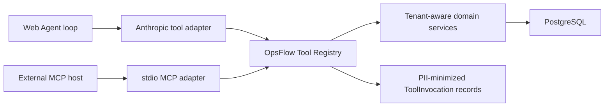

# Architecture

## Overview
OpsFlow is a modular monolith with a Next.js frontend, an Express API, Prisma, PostgreSQL, and Docker-based local/production infrastructure.

## Repository Layout
- `client` - Next.js App Router application
- `server` - Express API, Prisma schema, migrations, tests, and seed/dev scripts
- `docs` - product, engineering, and design documentation
- `infra` - deployment scripts and nginx production assets

## Frontend
- Next.js App Router
- React and TypeScript
- Tailwind CSS
- Zustand for auth/session state
- TanStack Query-style server state patterns through feature API modules
- React Hook Form and Zod for form handling and validation
- Vitest and Testing Library for UI tests

Current app surfaces:
- Login, register, and invitation acceptance
- Dashboard with live today's schedule and schedule-derived stats
- Customers
- Jobs and staff workspace
- Team management
- Activity feed
- Schedule calendar
- AI dispatch planner
- Notification bell and SSE updates

## Backend
- Express 5
- TypeScript
- Prisma ORM with PostgreSQL
- Zod request validation
- JWT access tokens with persisted refresh sessions
- Tenant-aware middleware and role checks
- Supertest/Vitest integration tests

Current modules:
- `auth` - registration, login, refresh, logout, tenant switching, invitations, RBAC helpers
- `customer` - tenant-scoped customer CRUD and notes
- `job` - job CRUD, schedule windows, assignment, workflow, schedule APIs, completion review
- `evidence` - job evidence upload/list/download/delete
- `membership` - team membership listing and owner-only role/status updates
- `audit` - tenant activity feed from audit logs
- `notification` - persisted notifications, unread counts, and SSE streaming
- `agent` - persisted AI dispatch planner conversations, tool traces, proposals, and proposal confirmation
- `operations-tools` - provider-neutral business tool contracts, Registry execution, exposure policy, and invocation audit hooks
- `mcp` - local stdio MCP adapter and access-session validation

## Database
PostgreSQL is the system of record. Tenant isolation is enforced through `tenantId` on business entities and tenant-aware query filters.

Core persisted models:
- `User`
- `Tenant`
- `Membership`
- `Customer`
- `Job`
- `JobStatusHistory`
- `JobCompletionReview`
- `JobEvidence`
- `AuthSession`
- `TenantInvitation`
- `AuditLog`
- `Notification`
- `AgentConversation`
- `AgentMessage`
- `AgentToolCall`
- `AgentProposal`
- `ToolInvocation`

## Key Flows

### Authentication And Tenant Context
Users authenticate with email/password. Successful login issues an access token and refresh token tied to an `AuthSession`. Tenant context is included in the authenticated request context and can be switched through `/api/auth/switch-tenant`.

### Job Lifecycle
Owners/managers create jobs for tenant customers. Jobs can be assigned to active staff, scheduled with start/end windows, moved through the workflow, and surfaced in staff-specific views.

### Completion Review
Staff submit completion notes from `IN_PROGRESS`. The job moves to `PENDING_REVIEW`. Owners/managers approve the review to complete the job or return it to `IN_PROGRESS` with a note.

### Evidence
Evidence files are uploaded through job-scoped endpoints and stored through a storage abstraction. The current default uses local disk storage.

### Notifications And Activity
Activity is tenant-wide audit history for owners/managers. Notifications are user-specific unread reminders and can stream to the UI over SSE.

### AI Dispatch Planner

The AI application layer is split into canonical business tools and thin protocol/provider adapters.

Each Registry entry owns its canonical name, description, Zod input/output schemas, allowed audiences, allowed roles, MCP-style behavior annotations, and execution handler. The Web Agent converts these definitions to provider tool schemas and keeps its tool-use loop. The local MCP server registers the same definitions over stdio. Neither adapter owns business logic.

Read tools query tenant-aware services. Task-oriented proposal tools reload current database snapshots and create pending proposals instead of directly mutating operational records. Confirmation in the Web app can create or update customers/jobs, assign work, schedule work, and apply approved status transitions.

Agent conversations, messages, tool calls, and proposals are persisted in PostgreSQL. Confirmed proposals are retained with confirmation metadata for audit.

External MCP proposals also create a persisted Agent conversation and assistant message. The MCP result includes an approval URL that opens that proposal in the Web UI. Tool invocations from both entry points record source, status, duration, correlation IDs, and field names without copying raw customer/job values into the invocation audit table.

See [Local MCP Integration](mcp.md) for the current tool catalog, setup, authorization boundary, and deferred remote transport work.

## Infrastructure
- Local development uses `docker-compose.dev.yml`.
- Production uses `docker-compose.prod.yml`.
- Nginx and production deploy scripts live under `infra`.
- GitHub Actions runs CI and deploys successful `main` builds to EC2.
- HTTPS is served through Nginx and Certbot.

## Current Limitations
- Dashboard metrics for the current daily dispatch surface are backed by a dedicated summary API; broader tenant analytics remain a future option.
- Request IDs and structured request/error logs are implemented. Broader rate limiting, a production error taxonomy, and external error monitoring remain planned hardening work.
- Evidence storage is local-first; S3-compatible storage is a future upgrade.
- There is no customer-facing portal yet.
- MCP is local stdio only. Remote transport, OAuth/client registration, and public MCP operations are deferred.
