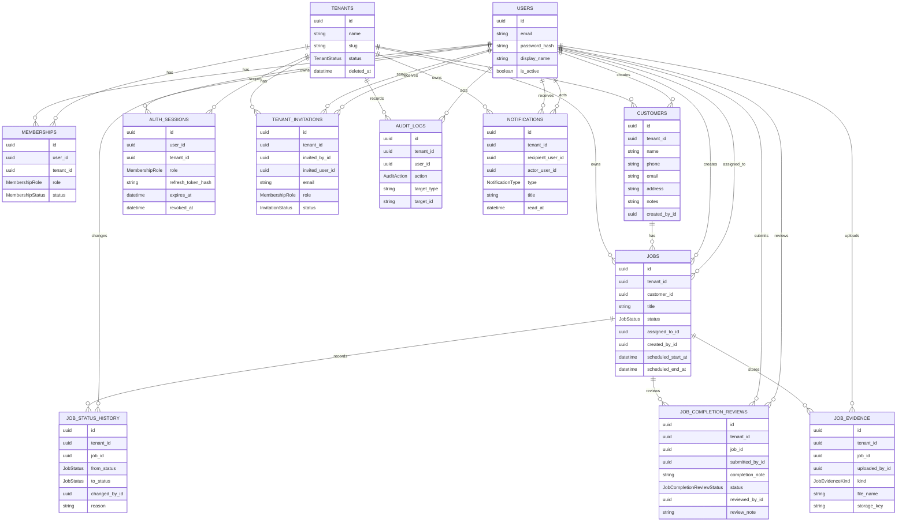

# ERD

This document is aligned with `server/prisma/schema.prisma`.

## Implemented Models
- `User`
- `Tenant`
- `Membership`
- `Customer`
- `Job`
- `JobStatusHistory`
- `JobCompletionReview`
- `JobEvidence`
- `AuthSession`
- `TenantInvitation`
- `AuditLog`
- `Notification`

## Core Relationships
- `User` and `Tenant` are many-to-many through `Membership`.
- `Tenant` is the data isolation boundary for customers, jobs, evidence, completion reviews, invitations, audit logs, auth sessions, and notifications.
- `Customer` belongs to one tenant and can have many jobs.
- `Job` belongs to one tenant and one customer through a tenant-safe composite customer relation.
- `Job.assignedToId` points to a user; there is no separate assignment table.
- `JobStatusHistory` records workflow transitions.
- `JobCompletionReview` records staff completion submissions and manager review outcomes.
- `JobEvidence` stores metadata for uploaded job files.
- `AuthSession` stores refresh-session state.
- `TenantInvitation` stores invitation lifecycle state.
- `AuditLog` stores tenant activity.
- `Notification` stores per-user in-app notifications.

## Important Notes
- All tenant-scoped business models include `tenant_id`.
- `Tenant` supports soft deactivation through `status` and `deleted_at`.
- `Job` keeps both legacy `scheduled_at` and current `scheduled_start_at` / `scheduled_end_at`; API and UI use the start/end window fields.
- `JobStatus` includes `PENDING_REVIEW`.
- Completion review AI fields already exist on `JobCompletionReview`, although automated AI review is not currently a primary user flow.

## Enums
- `TenantStatus`: `ACTIVE`, `DEACTIVATED`
- `MembershipRole`: `OWNER`, `MANAGER`, `STAFF`
- `MembershipStatus`: `ACTIVE`, `INVITED`, `DISABLED`
- `JobStatus`: `NEW`, `SCHEDULED`, `IN_PROGRESS`, `PENDING_REVIEW`, `COMPLETED`, `CANCELLED`
- `JobEvidenceKind`: `SITE_PHOTO`, `COMPLETION_PROOF`, `CUSTOMER_DOCUMENT`, `ISSUE_EVIDENCE`
- `JobCompletionReviewStatus`: `PENDING`, `APPROVED`, `RETURNED`
- `JobCompletionAiStatus`: `PENDING`, `APPROVED`, `NEEDS_REVIEW`, `FAILED`
- `InvitationStatus`: `PENDING`, `ACCEPTED`, `CANCELLED`, `EXPIRED`
- `NotificationType`: `JOB_ASSIGNED`, `JOB_UNASSIGNED`, `JOB_STATUS_CHANGED`, `JOB_COMPLETION_SUBMITTED`, `JOB_COMPLETION_APPROVED`, `JOB_COMPLETION_RETURNED`

## Future Candidates
- Quote
- Customer portal access model
- Payment/billing records
- External integration records

## ER Diagram

