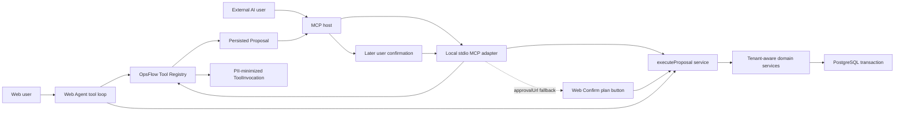

# Local MCP Integration

OpsFlow exposes a selected part of its AI tool surface through a local Model Context Protocol (MCP) server. The server uses stdio: an MCP host such as Codex CLI, Claude Code, or Claude Desktop starts the process locally and exchanges protocol messages through stdin/stdout.

The current workflow is Proposal-first but no longer requires a Web round trip for every eligible action:

```text
User requests an operational change
→ AI calls propose_create_job or propose_dispatch_job
→ Host displays the stored Proposal
→ User replies in a later message with explicit confirmation
→ Host calls execute_proposal (and may show a native tool approval)
→ OpsFlow revalidates and executes transactionally
→ Host displays the execution receipt
```

The returned Web approval URL and the Web `Confirm plan` button are retained as fallbacks. Remote Streamable HTTP transport, OAuth, and public MCP hosting remain out of scope.

## Architecture



The Tool Registry is the source of truth for tool names, descriptions, Zod input/output contracts, role rules, audience rules, annotations, conversation requirements, and execution handlers.

- The Web Agent converts Registry definitions to the AI provider's tool format and keeps its existing tool-use loop.
- The MCP adapter converts the same definitions to MCP tools and handles stdio framing, structured results, conversation persistence, and MCP invocation metadata.
- `propose_*` tools require a conversation context. The MCP adapter creates one when the first Proposal is saved.
- `get_proposal` and `execute_proposal` recover the original conversation from the Proposal and do not create empty conversations.
- Domain services own tenant isolation, authorization, execution-time revalidation, transactions, notifications, and audit logs.

MCP is therefore a protocol adapter, not a second implementation of OpsFlow business logic.

## Engineering Decisions To Discuss

| Decision | Reason | Repository evidence |
| --- | --- | --- |
| Registry before protocol adapters | Avoid provider-specific business logic and schema drift | Both the Web Agent and MCP factory enumerate `OpsFlowToolRegistry` |
| Tools model business tasks, not raw CRUD | Align one Proposal and one confirmation with a coherent operational intent | `propose_create_job` and `propose_dispatch_job` combine related fields |
| Proposal and execution are separate tools | Force a visible, multi-turn checkpoint before a business mutation | `propose_*` returns a pending Proposal; `execute_proposal` is a distinct destructive tool |
| Only low-risk job operations execute conversationally | Limit the first external write surface while retaining product usefulness | Only `CREATE_JOB`, `ASSIGN_JOB`, and `SCHEDULE_JOB` are allowed for Web Agent/MCP execution |
| Registry enforces access again at execution | Tool discovery is not a security boundary | Hidden-tool and excluded-role calls return `TOOL_PERMISSION_DENIED` |
| Proposal ID is the idempotency key | Host retries must not duplicate jobs, assignments, notifications, or business audit records | Confirmed Proposals return their stored `confirmationResult` |
| Conversation allocation is tool metadata | Read/execution calls should not create meaningless Agent conversations | `conversationContext` is `required` for `propose_*` and `none` for read/execute tools |
| Audit structure, not raw invocation values | Preserve source/status correlation without copying customer data or confirmation text | `ToolInvocation` stores input/output keys rather than values |
| Web remains a fallback | Hosts vary in conversation and native approval support | Every Proposal returns `approvalUrl`; the REST confirmation endpoint remains supported |
| Local stdio before remote transport | Demonstrate a complete MCP integration without prematurely adding public-server identity and operations concerns | `stdio.ts` is shipped; Streamable HTTP and OAuth are deferred |

## Exposed MCP Tools

The list is filtered by the authenticated role and each tool's `external-mcp` audience. Owner and Manager can discover the following surface; Staff cannot discover or directly invoke the Proposal execution tools.

| Tool | Purpose | Behavior |
| --- | --- | --- |
| `search_jobs` | Search tenant-scoped jobs | Read-only |
| `get_job` | Read one visible job | Read-only |
| `search_customers` | Search tenant-scoped customers | Read-only |
| `get_customer` | Read one visible customer | Read-only |
| `search_staff` | Search active staff | Read-only |
| `check_schedule_conflicts` | Check a proposed staff time window | Read-only |
| `propose_create_job` | Draft a new job, optionally with customer, schedule, and assignee data | Creates a pending Proposal and OpsFlow conversation |
| `propose_dispatch_job` | Draft assignment and/or scheduling for an existing job | Creates a pending Proposal and OpsFlow conversation |
| `get_proposal` | Read Proposal status, payload, approval mode, receipt, and Web fallback | Read-only and idempotent |
| `execute_proposal` | Execute a later-confirmed eligible Proposal | Destructive, idempotent, and limited to the allowed Proposal types |

Customer updates, job detail/status changes, cancellations, and the internal activity-feed tool remain outside the external MCP proposal surface. If an external caller obtains one of those Proposal IDs and tries to execute it, OpsFlow returns:

```json
{
  "error": true,
  "code": "PROPOSAL_WEB_APPROVAL_REQUIRED",
  "details": {
    "approvalUrl": "http://localhost:3000/agent?conversationId=...&proposalId=..."
  }
}
```

## Proposal Contract

The Proposal tools retain their previous fields and add an execution policy:

```ts
{
  proposalId: string;
  approvalRequired: true;
  approvalUrl: string;
  proposal: DispatchProposal;
  approvalMode: "CONVERSATIONAL_OR_WEB" | "WEB_ONLY";
  executionTool: "execute_proposal" | null;
  confirmationPrompt: string;
}
```

The two externally exposed Proposal tools currently return:

```ts
{
  approvalMode: "CONVERSATIONAL_OR_WEB";
  executionTool: "execute_proposal";
}
```

`get_proposal` can be used before a confirmation or after a retry to inspect `PENDING`, `CONFIRMING`, `CONFIRMED`, or `FAILED`. A confirmed Proposal includes its original `confirmationResult`.

`execute_proposal` requires:

```ts
{
  proposalId: string;
  confirmationText: string;
}
```

The host must pass the user's latest confirmation message verbatim. The service accepts a deliberately small allowlist of short phrases, including `OK`, `Confirm`, `OK, execute it`, `确认`, `可以了`, and `就这样执行`; matching ignores case, surrounding whitespace, and trailing full stops or exclamation marks. Questions, rejections, qualifications, change requests, and other text fail closed. The host must not call `execute_proposal` in the same user turn as `propose_*`, and it must show the Proposal before asking for confirmation.

## Confirmation And Trust Boundary

There are three execution sources with intentionally different evidence:

| Source | Evidence required by OpsFlow | Notes |
| --- | --- | --- |
| Web `Confirm plan` button | Authenticated Owner/Manager button request | Does not depend on LLM interpretation |
| Web Agent conversation | Exactly one pending Proposal in the conversation, plus a persisted User Message created after it; `confirmationText` must match exactly and pass the server allowlist | Multiple pending Proposals require the user to choose a Web approval button; non-allowlisted text fails closed |
| External MCP host | An allowlisted `confirmationText` supplied by the client | The server can reject unsafe text, but cannot prove that external chat text came from a human or followed the Proposal |

For external MCP, `destructiveHint: true` tells capable hosts that `execute_proposal` changes business state and should receive native tool approval. This annotation is a host hint, not proof of user identity or consent. Hosts without native approval fall back to the conversational checkpoint.

This is the explicit trust boundary: OpsFlow authenticates the token, requires allowlisted confirmation text, and revalidates the business operation, while the external host is responsible for faithfully presenting the Proposal, proving that confirmation came from a later human response, and passing that response without rewriting it. The server-side allowlist prevents obvious negative, questioning, or modifying text from being treated as approval; it does not establish the provenance of MCP input. The Web `Confirm plan` button remains the strongest approval path because it does not depend on an LLM or external host interpreting conversational intent.

The single-pending-Proposal rule applies to the Web Agent because a short reply such as `Confirm` does not identify a Proposal by itself. MCP execution already includes an explicit `proposalId`; its host remains responsible for associating that ID with the Proposal it displayed and the later confirmation it collected.

## Execution Safety And Idempotency

Before any write, the shared execution service verifies:

- the caller is an Owner or Manager;
- the Proposal belongs to the authenticated user and tenant;
- conversational confirmation text is allowlisted (and, for the Web Agent, exactly matches a post-Proposal User Message);
- Web Agent conversational execution targets the conversation's only pending Proposal;
- the Proposal review has no blocker;
- the source is allowed to execute that Proposal type;
- referenced jobs, customers, staff memberships, schedules, and job states are still valid;
- the Proposal can atomically move from `PENDING` to `CONFIRMING`.

All operational changes remain inside the existing Prisma transaction. The Proposal ID is the idempotency key:

- `CONFIRMED` returns the stored receipt without repeating business writes or notifications;
- `CONFIRMING` returns a conflict while another execution owns the lock;
- `FAILED` returns the recorded failure and does not automatically retry the mutation;
- a rejected Proposal remains `PENDING`.

Successful MCP execution writes an assistant receipt and tool call into the original Proposal conversation. The separate `ToolInvocation` audit row records `source=MCP`, tool name, Proposal ID, original conversation ID, status, duration, and input/output field names. It does not store the raw `confirmationText`.

## Authentication

- The stdio server requires an OpsFlow access token in `OPSFLOW_ACCESS_TOKEN`.
- Startup and every tool call validate the signed token, persisted session, expiry/revocation, active user, tenant, and role.
- The Registry repeats audience and role checks during execution.
- Domain services repeat tenant/user ownership checks and return not-found/permission errors for cross-user or cross-tenant Proposal IDs.

The access token is short-lived. When it expires, obtain a new token and restart the local MCP process. Never commit a token or place it in a shared configuration.

## Local Setup With Docker

Start the application:

```bash
cp .env.example .env
docker compose -f docker-compose.dev.yml up --build -d
```

Obtain a Manager token from the local API. This curl request is a normal application login used to produce the same access token that the Web client receives:

```bash
export OPSFLOW_ACCESS_TOKEN="$(
  curl -s http://localhost:4000/api/auth/login \
    -H 'Content-Type: application/json' \
    -d '{"email":"manager@acme.example","password":"manager-password-123"}' \
    | jq -r '.data.accessToken'
)"
```

Smoke-test the MCP entry point inside the already-running server container:

```bash
docker compose -f docker-compose.dev.yml exec \
  -T \
  -e OPSFLOW_ACCESS_TOKEN \
  server \
  pnpm mcp:stdio
```

The process waits for MCP protocol messages on stdin, so normal stdout remains reserved for the protocol. Use `Ctrl+C` after confirming there is no startup error on stderr.

## Codex CLI Configuration With Docker

Register the Docker-backed stdio command using an absolute Compose file path:

```bash
codex mcp add \
  --env OPSFLOW_ACCESS_TOKEN="$OPSFLOW_ACCESS_TOKEN" \
  opsflow-local \
  -- docker compose \
    -f /absolute/path/to/opsflow/docker-compose.dev.yml \
    exec \
    -T \
    -e OPSFLOW_ACCESS_TOKEN \
    server \
    pnpm mcp:stdio
```

This does not copy OpsFlow tools into Codex. It registers a command that Codex can start whenever it needs to connect to the local OpsFlow MCP server.

Verify registration:

```bash
codex mcp list
```

For a host-side process instead of Docker, install the server dependencies and configure the MCP host to run `pnpm --dir /absolute/path/to/opsflow/server mcp:stdio` with the same environment variable.

## Codex CLI Demonstration

Start a new Codex CLI session after registering the server, then use a two-turn interaction like this:

```text
User: Find Archie Wright's dishwasher job and assign it to Alex Nguyen tomorrow 9–11.

Codex:
1. calls search_customers / search_jobs / search_staff;
2. calls propose_dispatch_job;
3. displays the returned Proposal, warnings, and schedule;
4. asks whether the Proposal should be executed.

User: OK

Codex:
1. may show native approval for the destructive execute_proposal call;
2. passes confirmationText="OK" unchanged;
3. calls execute_proposal with the returned proposalId;
4. displays the CONFIRMED receipt.
```

Expected rules during the demonstration:

- Codex must not call `execute_proposal` during the first turn.
- A revision such as “可以改到下午吗” must not execute the existing Proposal.
- “不要执行” leaves the Proposal `PENDING`.
- A successful retry with the same Proposal ID returns the same receipt rather than applying the change twice.
- Opening `approvalUrl` is optional for the allowed Proposal types; use it when the host cannot complete conversational confirmation or when the Proposal is Web-only.

## Contract And Integration Tests

The automated coverage includes:

- MCP tool discovery and annotations;
- role/audience filtering and per-call token revalidation;
- structured errors with `code`, `details`, and `approvalUrl`;
- no new conversation for `get_proposal` or `execute_proposal`;
- execution receipt and invocation audit correlation to the original conversation;
- exact Web Agent confirmation text and post-Proposal message ordering;
- idempotent and concurrent execution behavior;
- Web chat rejection, success receipt, and Web fallback UX;
- LLM eval cases for explicit confirmation, revision questions, rejection, and same-turn prohibition.

Useful commands:

```bash
pnpm --dir server test mcp-server.contract.test.ts
pnpm --dir server test agent-persistence.integration.test.ts
pnpm --dir server ai:eval:cheap
pnpm --dir client test agent-chat.test.tsx
```

Database integration tests require the repository's explicit safe-test environment flags and a disposable database. Real LLM evals additionally require `RUN_LLM_EVALS=true` and an API key.

## Implementation Map

- `server/src/modules/operations-tools` — canonical Registry, schemas, execution definitions, and audit hook
- `server/src/modules/operations-tools/definitions/proposal-execution-tools.ts` — `get_proposal` and `execute_proposal`
- `server/src/modules/agent/agent.service.ts` — Proposal persistence, approval policy, shared execution service, and receipts
- `server/src/modules/agent/adapters/anthropic-tool-adapter.ts` — provider tool-schema adapter
- `server/src/modules/agent/agent-loop.ts` — Web Agent tool loop and confirmation instructions
- `server/src/modules/mcp/mcp-server.ts` — MCP registration, invocation, structured errors, and conversation persistence
- `server/src/modules/mcp/stdio.ts` — local stdio entry point and session authentication
- `server/tests/mcp-server.contract.test.ts` — real MCP client/server contract tests using an in-memory transport

## Current Scope

Implemented now:

- provider-neutral business tools shared by Web Agent and MCP;
- local stdio transport;
- role- and tenant-aware reads and Proposal creation;
- conversational execution for `CREATE_JOB`, `ASSIGN_JOB`, and `SCHEDULE_JOB`;
- Web Agent persisted-message verification;
- MCP host trust boundary plus destructive annotation;
- idempotent execution and original-conversation receipts;
- Web approval fallback;
- protocol contract tests, database integration tests, UI tests, and confirmation eval cases.

Deferred:

- remote Streamable HTTP transport;
- OAuth, service-account authorization, or client registration for remote clients;
- public MCP deployment, quotas, automatic remote token refresh, and remote transport operations;
- conversational execution for customer changes, job detail/status changes, and cancellations.
