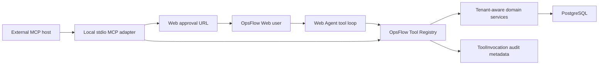

# Local MCP Integration

OpsFlow exposes a selected part of its AI tool surface through a local Model Context Protocol (MCP) server. The MCP process uses stdio, so an MCP host such as Claude Desktop or another compatible client starts it as a local child process. A remote HTTP MCP transport is intentionally out of scope for this iteration.

## Architecture



The Tool Registry is the source of truth for tool names, descriptions, Zod input/output contracts, role rules, audience rules, annotations, and execution handlers. The Web Agent and MCP server are adapters around that same application layer:

- The Web Agent converts Registry definitions to the AI provider's tool format and keeps its existing tool-use loop.
- The MCP adapter converts the same definitions to MCP tools and handles protocol framing over stdio.
- Domain services remain responsible for tenant filtering and business authorization.
- Proposal tools save pending proposals; they never directly perform the requested mutation.

This keeps MCP out of the domain layer. Adding another model provider or transport should require a new adapter, not another copy of the business tools.

## Engineering Decisions To Discuss

| Decision | Reason | Repository evidence |
| --- | --- | --- |
| Registry before protocol adapters | Avoid provider-specific business logic and schema drift | Both the Web Agent and MCP factory enumerate `OpsFlowToolRegistry` |
| Tools model business tasks, not raw CRUD | Give the model a smaller decision space and align one tool call with one approval | `propose_create_job` and `propose_dispatch_job` can combine related fields into one pending proposal |
| Registry enforces access again at execution | Tool-list filtering is discovery, not a security boundary | Direct hidden-tool and excluded-role calls return `TOOL_PERMISSION_DENIED` |
| MCP writes stop at a proposal | Preserve the same human-in-the-loop boundary used by the product UI | MCP returns `approvalUrl`; confirmation remains an authenticated Web action |
| Audit structure, not raw payloads | Keep source/status correlation without duplicating customer PII | `ToolInvocation` stores input/output field names rather than values |
| Local stdio before remote transport | Demonstrate a complete MCP integration without prematurely adding public-server identity and operations concerns | `stdio.ts` is shipped; Streamable HTTP and OAuth are explicitly deferred |

## Exposed MCP Tools

The exact list is filtered by the authenticated role and each tool's `external-mcp` audience setting. The current external surface is deliberately narrower than the Web Agent surface:

| Tool | Purpose | Mutation behavior |
| --- | --- | --- |
| `search_jobs` | Search tenant-scoped jobs | Read-only |
| `get_job` | Read one visible job | Read-only |
| `search_customers` | Search tenant-scoped customers | Read-only |
| `get_customer` | Read one visible customer | Read-only |
| `search_staff` | Search active staff | Read-only |
| `check_schedule_conflicts` | Check a proposed staff time window | Read-only |
| `propose_create_job` | Draft a new job, optionally with customer, schedule, and assignee data | Creates a pending proposal |
| `propose_dispatch_job` | Draft assignment and/or scheduling for an existing job | Creates a pending proposal |

Customer updates, job status changes, cancellations, and the internal activity-feed tool remain Web-only for now. This is an intentional exposure policy, not a protocol limitation.

## Security And Approval Boundary

- The stdio server requires an OpsFlow access token in `OPSFLOW_ACCESS_TOKEN`.
- Startup and every tool call validate the signed token, persisted session, session expiry/revocation, active user, tenant, and role.
- The Registry repeats audience and role checks during execution, so a caller cannot bypass filtering by invoking a hidden tool name directly.
- Domain services scope reads and proposal snapshots to the authenticated tenant.
- MCP proposal calls create an OpsFlow conversation and return an `approvalUrl`. The proposal appears in the Web Agent UI and still requires an Owner or Manager to confirm it.
- `ToolInvocation` records source, tool, status, duration, field names, and correlation IDs. Raw argument and result values are excluded from this audit record to reduce PII exposure.

The access token is short-lived. When it expires, obtain a new token and restart the local MCP process. Never commit a token or place it in a shared MCP configuration.

## Local Setup

Start OpsFlow and install the host-side server dependencies:

```bash
cp .env.example .env
cp server/.env.example server/.env
docker compose -f docker-compose.dev.yml up --build -d
pnpm --dir server install
```

The local MCP process reads `server/.env` and connects directly to PostgreSQL through Prisma. The Web client and Express API are also needed for login and proposal review.

Obtain a Manager access token from the local API:

```bash
curl -s http://localhost:4000/api/auth/login \
  -H 'Content-Type: application/json' \
  -d '{"email":"manager@acme.example","password":"manager-password-123"}' \
  | jq -r '.data.accessToken'
```

Smoke-test startup from a terminal. The process waits for MCP messages on stdin, so no normal stdout output is expected:

```bash
cd server
OPSFLOW_ACCESS_TOKEN='<access-token>' pnpm mcp:stdio
```

Use `Ctrl+C` after confirming the process starts without an error on stderr.

## MCP Host Configuration

Use an absolute path to the `server` directory:

```json
{
  "mcpServers": {
    "opsflow-local": {
      "command": "pnpm",
      "args": [
        "--dir",
        "/absolute/path/to/opsflow/server",
        "run",
        "mcp:stdio"
      ],
      "env": {
        "OPSFLOW_ACCESS_TOKEN": "<access-token>"
      }
    }
  }
}
```

After the host connects, verify that it can list role-appropriate tools, call `search_jobs`, and create a `propose_dispatch_job` proposal. Open the returned `approvalUrl` to review and confirm the proposal in OpsFlow.

## Implementation Map

- `server/src/modules/operations-tools` — canonical Registry, schemas, execution, and audit hook
- `server/src/modules/agent/adapters/anthropic-tool-adapter.ts` — provider tool-schema adapter
- `server/src/modules/agent/agent-loop.ts` — Web Agent tool loop
- `server/src/modules/mcp/mcp-server.ts` — MCP tool registration and invocation adapter
- `server/src/modules/mcp/stdio.ts` — local stdio entry point and session authentication
- `server/tests/mcp-server.contract.test.ts` — real MCP client/server contract tests using an in-memory transport

## Current Scope

Implemented now:

- provider-neutral business tools shared by Web and MCP
- local stdio transport
- role- and tenant-aware execution
- human approval handoff to the Web app
- protocol contract tests and minimal invocation audit records

Deferred:

- remote Streamable HTTP transport
- OAuth or service-account authorization for remote clients
- public deployment, client registration, quotas, and remote transport operations
